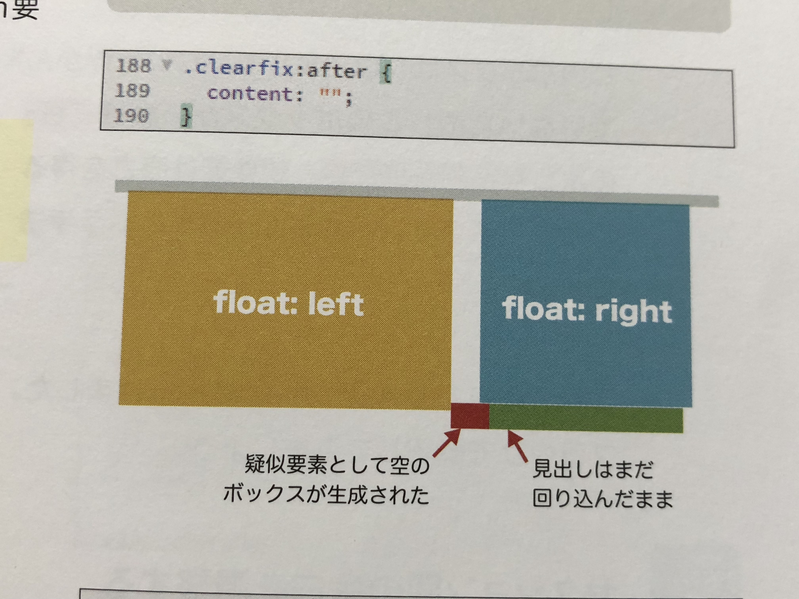
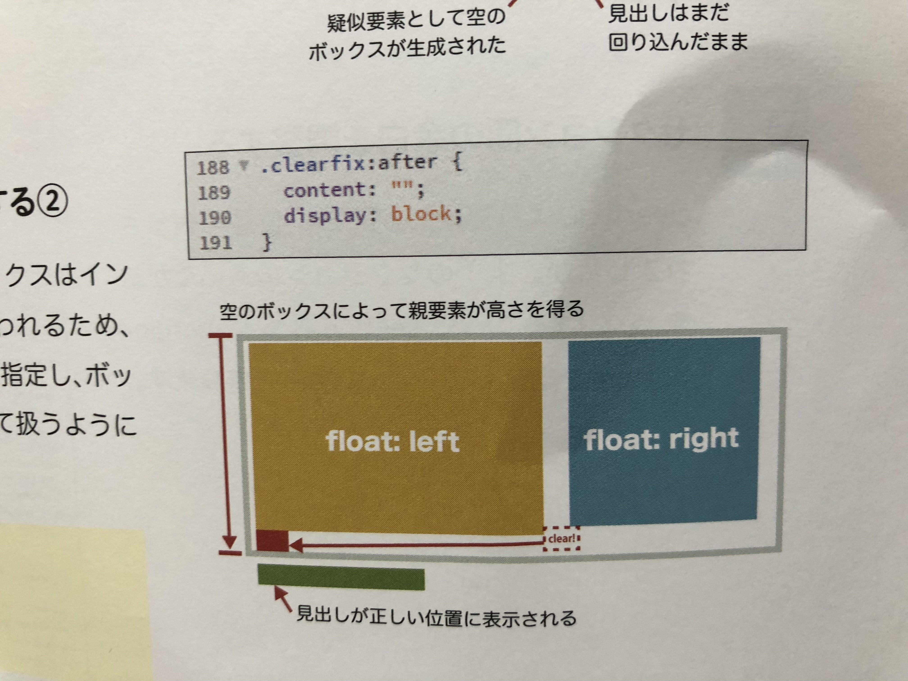
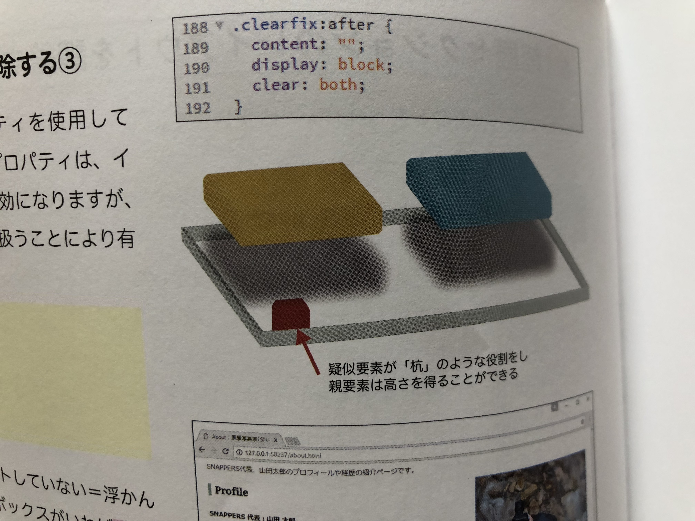
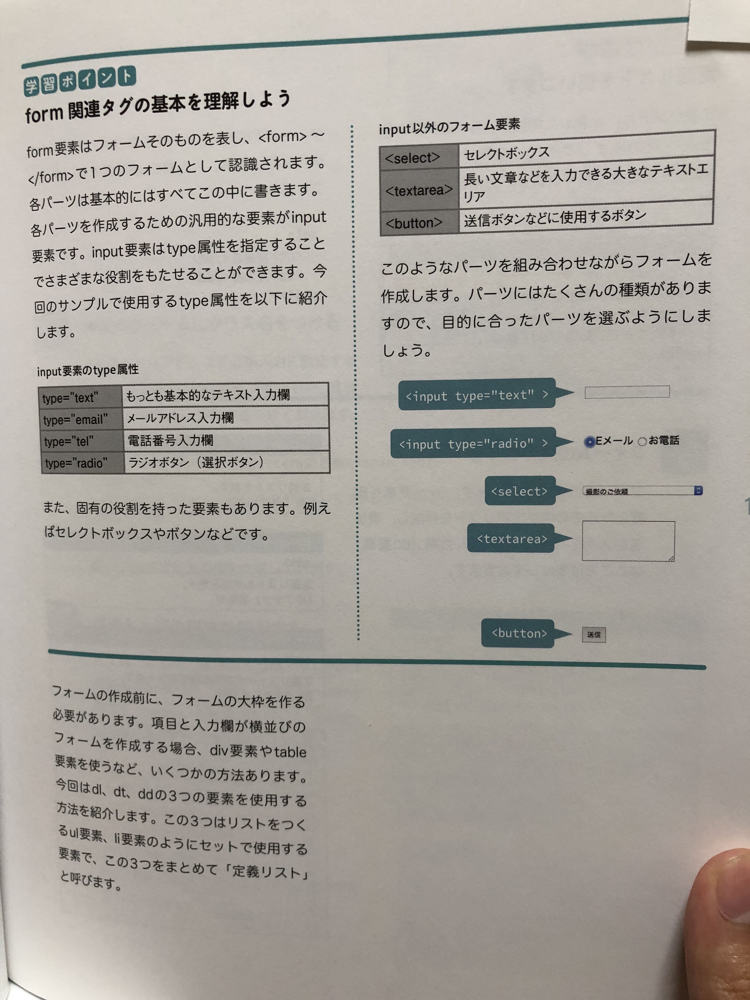

# HTML & CSSとWebデザインが一冊できちんと身につく本


## この本から学びたいこと

- HTMLのベターなクラス構造の勉強
- レスポンシブ対応
- Webサイトとデザインの基礎知識をつける


## Webサイトの仕組みについて


- Webサイトはただ「見る」ためのものではなく「使う」ものということです。
- 目的の情報にすぐにたどり着くことができることが理想的なWebサイトの設計
- サーバーにインターネット上のスペースにWebサイトのデータをアップロードする必要がある。
- 使いやすさのことを「ユーザビリティ」と呼ぶ
- スマートフォンでの表示に最適化することはこれからのWebデザインには必須の条件である


**検索される仕組み**

- 検索結果にひょじされるには「検索エンジン」というコンピュータに対して情報を知らせる必要がある。
- インターネット上のWebサイトを巡回してデータを集めるシステム「クローラー」
- どんな言語で書かれてるかなどの情報をデータ部０巣に蓄積することを「インデックス」


**Webサイトを構成するファイル**

- JPEG - 写真やグラデーションなど細かい色調をもった画像に使用される。データをあまり劣化させずに圧縮でき、ファイルサイズを小さくできるというメリットがある。1677万食の色を使える。保存のたびに画質が劣化する
- GIF - 単色のアイコンやベタ塗りの画像など、シンプルな画像に使用する。256食しか使えない。
- PNG - JPEG,GIFの両方のメリットを持っている。PNGファイルは画質の劣化がなく、1677万色をしようできる。ファイルサイズがJPEGより若干大きくなる。画像は劣化しない。


## レイアウトのパターンと選び方


- シングルカラム
- ２カラム
- 3カラム
- グリッドレイアウト
- フルスクリーン

最近の傾向はスマートフォンでの閲覧がしやすいことなどからシングルカラムレイアウトが主流


## HTMLの基本


### section element and article element


**section**

用や節など意味的に関係のある要素をまとめる

sectionは必ず見出しを入れるというルールがあります。


**article**

その内容だけを取り出した時に独立したコンテンツとして成り立つ場合に使用する

```
<article>
  <h1>hogehoge</h1>

  <section>
    <h2>fugafuga</h2>
    <p>piyopiyopiyopiyo</p>
  </section>


  <section>
    <h2>fugafuga</h2>
    <p>piyopiyopiyopiyo</p>
  </section>

</article>


```


**wrap**

包むという意味で全体を包む要素のID名に使われることが多い

```
<div> id="wrap"></div>
```


## CSSの基本


**vertical-align: bottom;**

画像を表示するimg要素の下部に意図しない余白ができてしまうことがある。画像の縦位置を調整する


**Webサイトの横幅サイズ**

Webサイトの横幅に960pxがよく使われる理由がPCディスプレイサイズが1024x768$とされているため

問題なく表示されるサイズ960pxという数値が基準になっています


## シングルカラムレイアウト

**メリット**

スマートフォンなど小さい画面にコンテンツを表示したい時に少しでも表示エリアを大きく確保できる。

**デメリット**

ECサイトなどページ数が多いサイトはサイドバーがあった方がサイト内の回避性が高く、ブログなどの媒体などもサイドバーが有効活用される


## シングルカラムでWebページをデザインする際の注意点

テキストのレイアウト方法。コンテンツエリアの横幅が広くなるため、文字の大きさやテキストの量によっては、

文章が読みにくくなってしまうことがある。

1行あたり30文字程度が人がもっとも読みやすい平均的な文字数。


font-size = 30pxにすると30 x 960px(横幅)でちょうど読みやすくなる。


### float プロパティを使用すると親要素の高さがなくなる


```
.clearfix:after {
content: "";
display: block;
clear: both;
```


- content: "";  ここで最後の子要素の後に擬似要素のとしてのからのボックスが生成される




- display: block; inline to block要素にするから左詰の要素となる

  

- clear: both; floatを解除する




### border-spacing

隣り合うセルのボーダーどうしの距離を指定する

```
border-spacing: 0;q
```


### border-collapse

隣り合うセルのボーダーを結合するか分離するか指定する

```
border-collapse: collapse; # 結合
```


## ファビコン

Webブラウザのタブやブックマークリストに表示されるアイコンのことで小さながらもWebサイトの存在感を示す大切なアイコン

100 x 100ほどの正方形の画像を用意する

ファイルサイズは150kbを超えないようにする

```
  <link rel="shortcut icon" href="../images/favicon.ico">
```


## Form




## Viewport

表示領域を設定するために必要な記述

HTMLファイルのhead要素内にmeta要素を使用して記述します。

```
<meta name="viewport" content="width=device-width, initial-scale=1">
```

**width=device-width**は端末のサイズに自動的に合わせる値

**initial-scale**は初期のズーム倍率を指定する。

スマホ表示は600px以下

**メディアクエリ**ブレイクポイントが決まったら反映させるためのメディアクエリを使用する

```
<link href="css/sp.css" rel="stylesheet" media="screen and (max-width:600px)">
```

画面の幅600pxより小さい場合はsp.cssが適用される


```
@media screen and (max-width:600px){
    /* 画面サイズが600px以下の場合に適用 */
}
```


@mediaはメディアクエリの目印で{}の中に処理を書き込む


### レスポンシブデザインでのサイズ指定

### vw(viewport width)

レスポンシブデザインにおいては「vw」という単位を使用することがある。

viewport width の略でビュ０ポートの幅に対するう割合を表し、webブラウザ全体の横幅を100vwと記述します。

ブラウザの幅が1000pxでも文字サイズを18pxにしたい場合は

18 / 1000 * 100 = 1.8 vwとなる。

%との違いは%は親要素のに対する割合。

vm はwebブラウザの幅に対しての割合。


### width: auto;

横幅をブラウザに合わせて可変したいときに使う


## テクニック


### borderで見出しを装飾する

```

.icon:before{
  content: "";
  padding-right: 10px;
  border-left: 7px solid #9cb4a4;
}

```


### イメージにマウスオーバーした時に透明度をあげる

```
a img:hover {
    opacity: 0.8;
}
```


### ページ内リンク

```
<a href="hogehoge.html#id_Name"></a>
```


### 特定の条件に当てはまる要素を指定する擬似クラス

```
#photograph .photograph-list li:nth-child(3n){
  margin-right: 0;
}
```

:nth-child() という擬似クラスは、ある要素のこ要素は最初から数えて２番めや２の倍数の要素などと指定できる

- 2番目の要素をしてするには :nth-child(2) 
- 2の倍数の要素を指定するには :nth-child(2n)
- 最初の要素を指定するには :first-child
- 最後の要素を指定するには :last-child


### ボタンに乗ったポインタの形状を指定する

```

#contact .form button:hover {
  background-color: #ffffff;
  color: #009cd3;
  cursor: pointer; # ここで形状を変えている
}
```


### 注意点(赤い印)

```
#contact .form .required:after{
  content: " * ";
  color: #ff0000;
}
```


